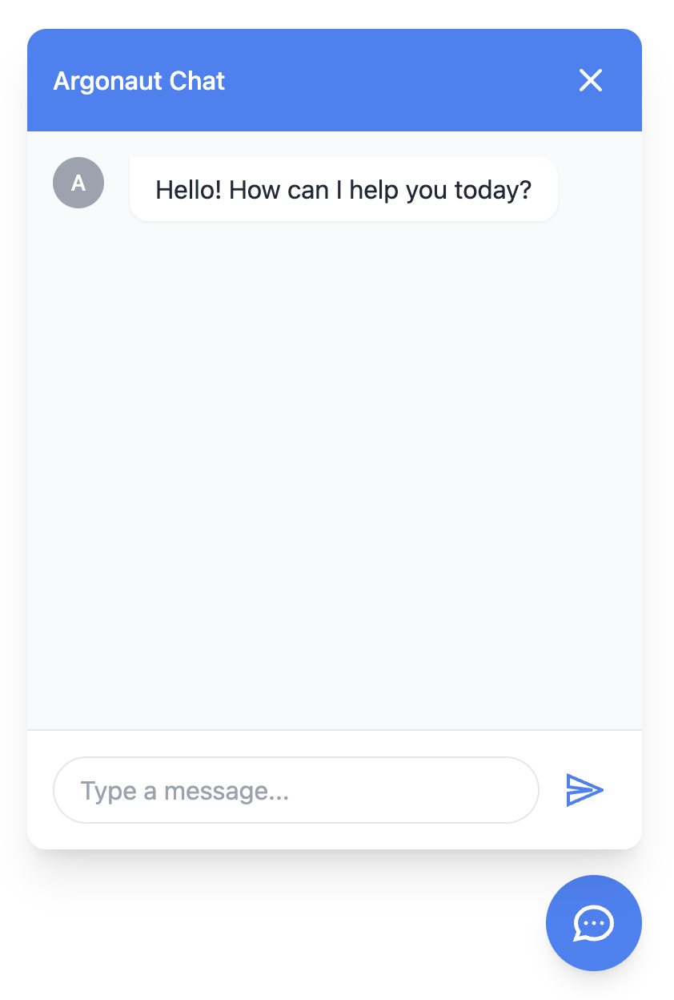

# ArgoChat

ArgoChat is a lightweight, customizable chat widget for integrating [Argo](https://app.argo-g.pt) AI agents into any website. Built with Lit and bundled as a standalone web component, it provides a seamless chat experience with zero external dependencies.



## Features

- 🚀 Zero-dependency standalone web component
- 🎨 Fully customizable theme and appearance
- 📱 Responsive design that works on all devices
- 🔌 Simple integration with just a few lines of code
- 💬 Direct integration with Argo AI agents
- 🎯 Flexible positioning options

## Table of Contents

- [ArgoChat](#argochat)
  - [Features](#features)
  - [Table of Contents](#table-of-contents)
  - [Installation](#installation)
    - [Using CDN (Recommended)](#using-cdn-recommended)
    - [Using NPM](#using-npm)
  - [Usage](#usage)
    - [Basic Setup](#basic-setup)
    - [Configuration](#configuration)
      - [ChatOptions Interface](#chatoptions-interface)
      - [ThemeOptions Interface](#themeoptions-interface)
      - [ToggleButtonOptions Interface](#togglebuttonoptions-interface)
    - [Styling](#styling)
      - [Custom Fonts](#custom-fonts)
      - [Custom Icons](#custom-icons)
    - [Examples](#examples)
      - [Complete Integration Example](#complete-integration-example)
  - [Development](#development)
    - [Setup](#setup)
    - [Publishing](#publishing)
    - [Contributing](#contributing)
  - [Support](#support)

## Installation

You can integrate ArgoChat into your website in multiple ways:

### Using CDN (Recommended)

Add the following script tag to your HTML:

```html
<script type="module" src="https://cdn.jsdelivr.net/npm/@hestia.ai/argo-chat@latest/dist/argo-chat.js"></script>
```

### Using NPM

```bash
npm i @hestia.ai/argo-chat
```

## Usage

### Basic Setup

1. Create an agent on [Argo](https://app.argo-g.pt)
2. Get your API key from the Argo dashboard
3. Add ArgoChat to your website:

```html
<script type="module">
    import { ArgoChat } from 'argo-chat';
    
    const chat = new ArgoChat({
        apiKey: 'your-argo-api-key',
    });
    
    document.body.appendChild(chat);
</script>
```

### Configuration

#### ChatOptions Interface

```typescript
interface ChatOptions {
    title: string;           // Title of the chat window
    apiKey: string;          // Your Argo API key
    apiEndpoint: string;     // Argo API endpoint
    greeting: string;        // Greeting message displayed when opened
    position: 'bottom-right' | 'bottom-left';  // Chat position
    placeholder: string;     // Input field placeholder
    theme: ThemeOptions;     // Theme configuration
    user_icon?: string;      // User message icon (optional)
    assistant_icon?: string; // Assistant message icon (optional)
    toggleButton: ToggleButtonOptions;  // Toggle button configuration
}
```

#### ThemeOptions Interface

```typescript
interface ThemeOptions {
    primaryColor: string;    // Primary color (hex format)
    textColor: string;       // Text color on primary background (hex)
    fontFamily: string;      // Font family (import separately)
}
```

#### ToggleButtonOptions Interface

```typescript
interface ToggleButtonOptions {
    icon: string;           // SVG icon string
    icon_size: string;      // Icon size (CSS units)
    btn_size: string;       // Button size (CSS units)
}
```

### Styling

#### Custom Fonts

Import your desired font and specify it in the theme options:

```html
<link href="https://fonts.googleapis.com/css2?family=Inter:wght@400;500;600&display=swap" rel="stylesheet">
```

```javascript
theme: {
    fontFamily: 'Inter, sans-serif'
}
```

#### Custom Icons

Customize the chat icons:

```javascript
{
    user_icon: '<svg>...</svg>',
    assistant_icon: '<svg>...</svg>',
    toggleButton: {
        icon: '<svg>...</svg>'
    }
}
```

### Examples

#### Complete Integration Example

```html
<!DOCTYPE html>
<html lang="en">
<head>
    <meta charset="UTF-8">
    <meta name="viewport" content="width=device-width, initial-scale=1.0">
    <title>ArgoChat Example</title>
    <link href="https://fonts.googleapis.com/css2?family=Inter:wght@400;500;600&display=swap" rel="stylesheet">
</head>
<body>
    <script type="module">
        import { ArgoChat } from 'argo-chat';
        
        const chat = new ArgoChat({
            title: 'AI Assistant',
            apiKey: 'your-argo-api-key',
            greeting: 'Welcome! How can I help you today?',
            position: 'bottom-right',
            placeholder: 'Type your message...',
            theme: {
                primaryColor: '#007bff',
                textColor: '#ffffff',
                fontFamily: 'Inter, sans-serif'
            },
            toggleButton: {
                icon: '<svg>...</svg>',
                icon_size: '24px',
                btn_size: '56px'
            }
        });
        
        document.body.appendChild(chat);
    </script>
</body>
</html>
```

## Development

### Setup

Prerequisites:
- Node.js (v16 or higher)
- npm or yarn

1. Clone the repository:
```bash
git clone https://github.com/hestiaAI/argo-chat.git
cd argo-chat
```

2. Install dependencies:
```bash
npm install
```

3. Start the development server:
```bash
npm run dev
```

4. Build the package:
```bash
npm run build
```

5. Test the build:
```bash
npm run serve
```

Visit `http://localhost:3000` to see the test page.

### Publishing

To publish a new version:
1. Login to NPM:
```bash
npm login --scope=@hestiaai
```
2. Update version in package.json:
```bash
npm version patch  # or minor or major
```

3. Build and test:
```bash
npm run ci
npm run build

# Pack the package locally
npm pack

# This will create a file like argo-chat-1.0.0.tgz
# You can install it locally in a test project:
npm install ../path/to/hestiaai/argo-chat-1.0.0.tgz
```

4. Publish to npm:
```bash
npm publish
```

The new version will automatically be available on the CDN after publishing.

### Contributing

We welcome contributions! Please follow these steps:

1. Fork the repository
2. Create a feature branch (`git checkout -b feature/amazing-feature`)
3. Commit your changes (`git commit -m 'Add amazing feature'`)
4. Push to the branch (`git push origin feature/amazing-feature`)
5. Open a Pull Request

## Support

If you encounter any issues or have questions:

1. Check the [Issues](https://github.com/hestiaai/argo-chat/issues) page
2. Create a new issue if your problem isn't already listed
3. Contact support at support@hestia.ai

---

Built with ❤️ by [Hestia.ai](https://hestia.ai)